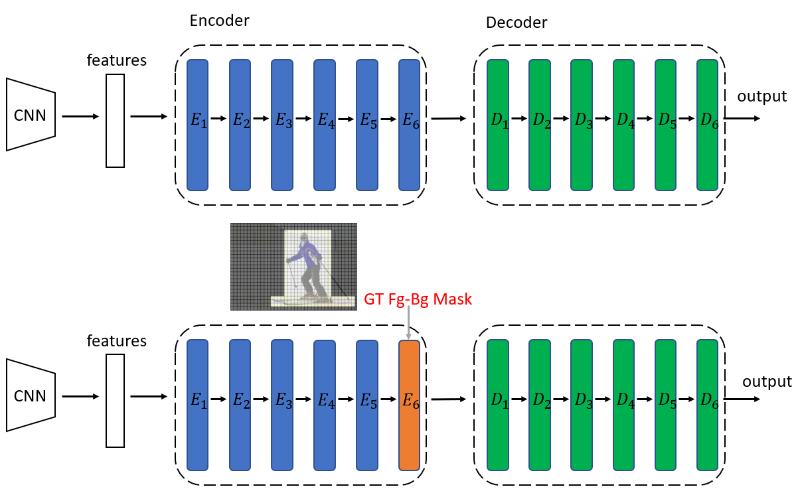
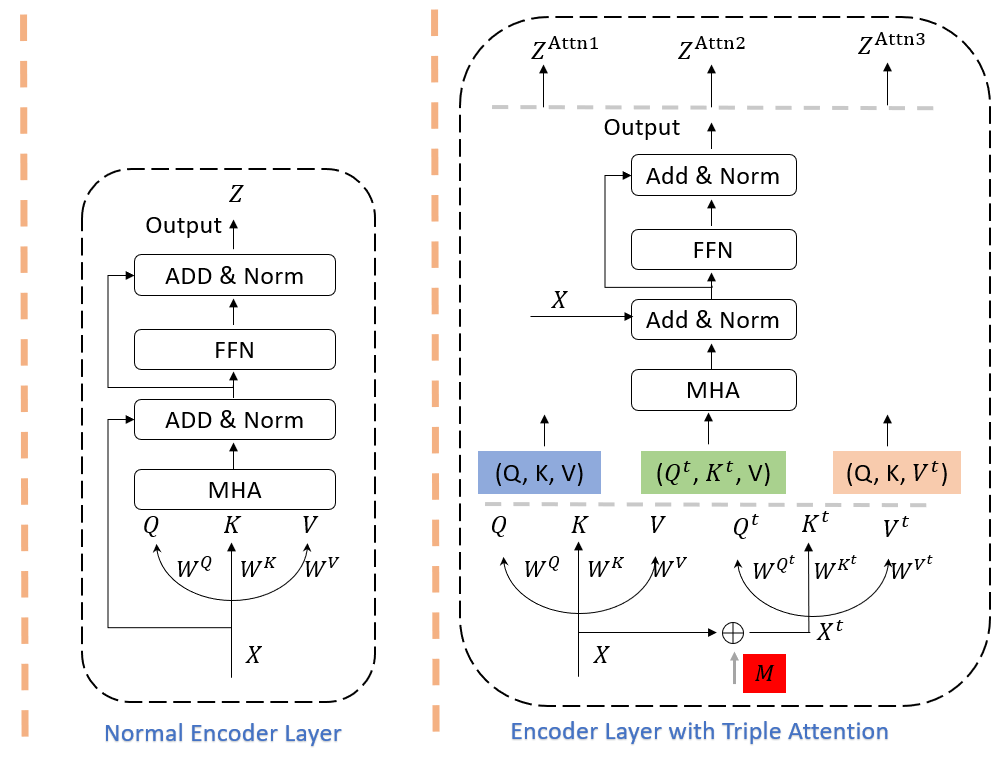
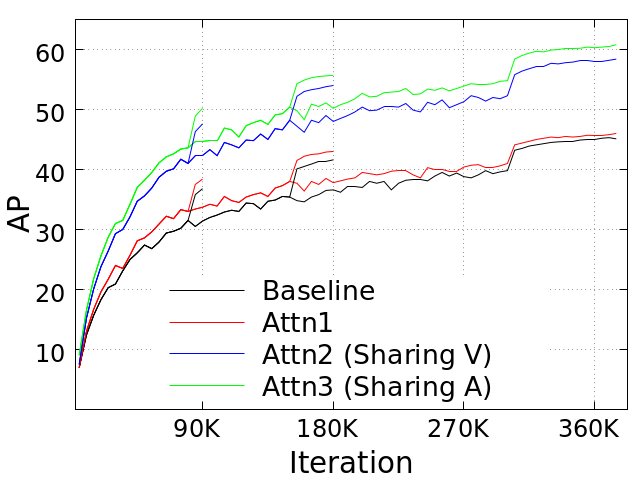

<h2 align="left">KS-DETR: Knowledge Sharing in Attention Learning for Detection Transformer</h2>


We release our code for our submitted manuscript `KS-DETR: Knowledge Sharing in Attention Learning for Detection Transformer`.

<div align="center">
  
 

[comment]: <> (  )
</div><br/>

 

## Main results


## What's New


## Installation

```shell

conda create -n ksdetr python=3.8 -y
conda activate ksdetr

git clone https://github.com/edocanonymous/KS-DETR.git
cd KS-DETR
python -m pip install -e detectron2
pip install -e .

```

## Getting Started


## Model Zoo
Results and models are available in [model zoo](https://detrex.readthedocs.io/en/latest/tutorials/Model_Zoo.html).


## License

This project is released under the [Apache 2.0 license](LICENSE).


## Acknowledgement
- Our code is built on detrex, which is an open-source toolbox for Transformer-based detection algorithms created by researchers of **IDEACVR**. 

- detrex is built based on [Detectron2](https://github.com/facebookresearch/detectron2) and part of its module design is borrowed from [MMDetection](https://github.com/open-mmlab/mmdetection), [DETR](https://github.com/facebookresearch/detr), and [Deformable-DETR](https://github.com/fundamentalvision/Deformable-DETR).


